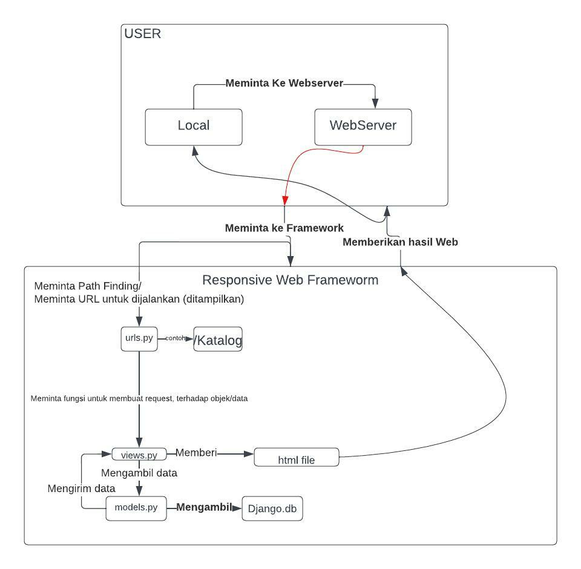

## Link Repository
https://github.com/sherlockjack/tugas2pbp

## Bagan *Request Client* ke Web Aplikasi berbasis Django

### Penjelasan Bagan di Atas

User meminta untuk menjalankan website dari lokal.
Dari Webserver meminta kepada framework, dimana kita meminta kepada urls.py untuk dibuatkan path untuk url nya.
Selanjutnya kita membuat fungsi untuk meminta request untuk mengambil objek/data ke views.py.
views.py mengambil data dari model.py dan model.py mendapatkannya dari django.py, lalu dikirim dan dikirim kembali ke views.py, views.py memberikannya kepada html file dan semuanya akan dikirim untuk dijalankan dan bisa dibuka dari local.

## Mengapa Menggunakan *Virtual Environment*?
Supaya membuat sebuah task tidak saling bertabrakan ketika menjalankan 2 localhost yang sama.

## Cara Pengimplementasian Program Tugas 2

Membuat fungsi request didalam views.py dan mengembalikan nilainya.
Setelah itu mengatur url pattern dari dalam urls.py
Dan setelah itu kita pergi ke katalog.html membuat sebuah list yang sama.
Setelah itu kita ngasih di urls.py yang ada di project_django untuk membuat urlsnya katalog/.
Setelah itu kita membuat migration dan migrates dan kita push ke git, kita mengambil HEROKU_API KEY dan HEROKU_APP_NAME.
Setelah itu deploy ke Heroku dan selesai.